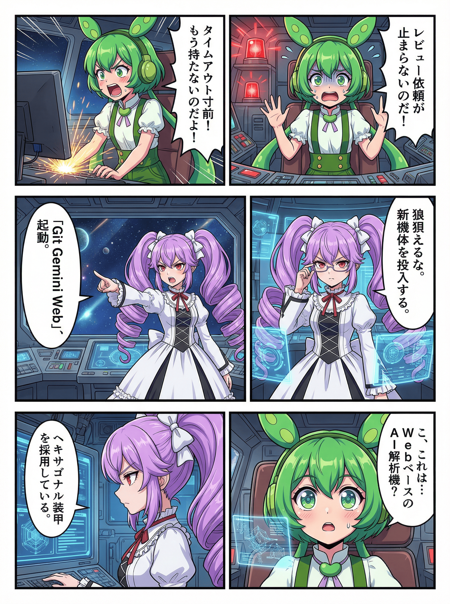

# 🤖 Git Gemini Web

[](https://golang.org/)
[](https://golang.org/)
[](https://github.com/shouni/git-gemini-web/tags)
[](https://opensource.org/licenses/MIT)

## 🚀 概要 (About) - WebベースのAIレビューオーケストレーター

**Git Gemini Web** は、AIコードレビューの**コアライブラリ機能**を **[Gemini Reviewer Core](https://github.com/shouni/gemini-reviewer-core)** を活用し、その機能を **Cloud Run** および **Google Cloud Tasks** を利用して **Webアプリケーション化** したプロジェクトです。

Webフォームを通じてレビュー依頼を受け付け、高負荷なAI解析処理を **非同期ワーカー（Cloud Tasks）** で実行するためのオーケストレーションを担います。

---

## 🏗 アーキテクチャ設計 (Architecture)

本プロジェクトは **ヘキサゴナル・アーキテクチャ** を採用し、ビジネスロジックを外部依存（GCP, Git, Slack等）から隔離しています。

* **Ports & Adapters**: `internal/domain/ports.go` に全てのインターフェース（Port）を集約し、依存性の逆転を実現しています。
* **指揮官 (Pipeline) と実働部隊 (Runner)**: ワークフローの制御ロジックと、個別の技術詳細（AI通信、ファイル生成）を分離し、高い保守性とテスト容易性を確保しています。

---

## ✨ 技術スタック (Technology Stack)

| 要素 | 技術 / ライブラリ | 役割 |
| --- | --- | --- |
| **言語** | **Go (Golang)** | 全体の開発言語。 |
| **AIバックエンド** | **Hybrid Gemini Adapter** | **Google AI Studio** または **Vertex AI** を自動切替可能。 |
| **コアレビュー機能** | **[`github.com/shouni/gemini-reviewer-core`](https://github.com/shouni/gemini-reviewer-core)** | Git操作、AI解析、レポート生成の基底ロジック。 |
| **非同期実行** | **Google Cloud Tasks** | 重いレビュー処理を非同期キューで管理。 |
| **認証・セッション** | **OAuth 2.0 / Gorilla Sessions** | Googleアカウントによるアクセス制限。 |
| **I/O抽象化** | **[`github.com/shouni/go-remote-io`](https://github.com/shouni/go-remote-io)**| GCS操作と署名付きURL生成の抽象化。 |

---

## 🤖 ハイブリッドなAIバックエンド対応

本アプリは、環境変数に応じて2つのAPIバックエンドを透過的に切り替え可能です。これにより、特定のAPIのサービス停止（503 Unavailable等）時にも柔軟に対応できます。

1. **Google AI Studio (API Key方式)**: 低遅延でプロトタイプ開発や個人利用に最適。
2. **Vertex AI (GCP方式)**: エンタープライズレベルのSLA、高いクォータ制限、組織的な予算管理に対応。

---

## 🎨 概要イメージ




---

## 🚀 使い方 (Usage) / セットアップ

### 1\. GCPコンソールでの事前準備 (OAuth) 🔐

アプリケーションを実行する前に、Google Cloud ConsoleでOAuth認証情報を設定する必要があります。

### 2\. 必要な環境変数

実行環境には以下の環境変数を設定する必要があります。

**基本設定:**

| 環境変数 | 説明 | デフォルト値（例） |
| :--- | :--- | :--- |
| `SERVICE_URL` | アプリケーションのルートURL (末尾スラッシュなし)。**本番環境ではHTTPS (`https://...`) が必須です。** | `https://myapp.run.app` または `http://localhost:8080` |
| `PORT` | サーバーがリッスンするポート | `8080` |
| `GCP_PROJECT_ID` | GCPのプロジェクトID | `your-gcp-project` |
| `GCP_LOCATION_ID` | Cloud Tasks キューのリージョン | `asia-northeast1` |
| `CLOUD_TASKS_QUEUE_ID` | 使用するCloud Tasksのキュー名 | `review-queue` |
| `SERVICE_ACCOUNT_EMAIL` | タスク発行に使用するサービスアカウント | - |
| `GCS_REVIEW_BUCKET` | レビュー結果（HTML）を保存するGCSバケット名 | `your-review-archive-bucket` |
| `GEMINI_API_KEY` | Google Gemini APIキー | - |
| `GEMINI_MODEL` | 使用するGeminiモデル名 | `gemini-2.5-flash` |
| `SSH_KEY_PATH` | Git操作用のSSH秘密鍵パス（Secret Managerマウント推奨） | `/secrets/ssh/id_rsa` |
| `SLACK_WEBHOOK_URL` | レビュー結果のURLを通知するためのSlack Webhook URL。未設定の場合は通知をスキップします。 | `https://hooks.slack.com/services/T...` |

**認証設定 (OAuth):**

| 環境変数 | 説明 | 設定例 |
| :--- | :--- | :--- |
| `GOOGLE_CLIENT_ID` | GCPで作成したOAuthクライアントID | `xxxx.apps.googleusercontent.com` |
| `GOOGLE_CLIENT_SECRET` | GCPで作成したOAuthシークレット | `GOCSPX-xxxx...` |
| `SESSION_SECRET` | セッションデータのHMAC署名用シークレット | `openssl rand -base64 32` 等で生成 |
| `SESSION_ENCRYPT_KEY` | セッションデータのAES暗号化用シークレット | `openssl rand -base64 32` 等で生成 |
| `ALLOWED_EMAILS` / `ALLOWED_DOMAINS` | **必須:** アクセスを許可するメールアドレスまたはドメイン (例: `user@example.com,user2@example.com` / `example.com`)。**どちらか一方は設定が必要です。** | `,`で区切る |

### 3\. 必要なIAMロールの設定

本アプリケーションをGoogle Cloud RunとCloud Tasksで安全に運用するためには、各サービスアカウント（SA）に対し、**正確な権限付与**が必要です。設定が不足していると `403 Forbidden` エラーが発生します。

#### A. Cloud Run サービスアカウント (アプリケーション実行用)

*Webフロントエンドおよびワーカーとして動作するサービスアカウントです。*

| 権限（IAMロール） | 目的 |
| :--- | :--- |
| **Cloud Tasks エンキューア**<br>(`roles/cloudtasks.enqueuer`) | Webフォーム受付時に、タスクを Cloud Tasks キューに**追加**するために必要です。 |
| **サービス アカウント ユーザー**<br>(`roles/iam.serviceAccountUser`) | **重要:** タスク投入時、そのタスクを実行するID（Cloud Tasks SA）として振る舞う（ActAs）ために必要です。これがないとOIDCトークン付きのタスクを作成できません。 |
| **Storage オブジェクト管理者**<br>(`roles/storage.objectAdmin`) | AIレビュー結果のHTMLファイルを **GCS** バケットに書き込むために必要です。 |
| **Secret Manager のシークレット アクセサー**<br>(`roles/secretmanager.secretAccessor`) | `GEMINI_API_KEY` を Secret Manager から安全に取得する場合に推奨されます。 |

#### B. Cloud Tasks サービスアカウント (タスク実行ID)

*Cloud Tasks がワーカー（Cloud Run）を呼び出す際に使用するIDです。アプリケーションSAと同じものを使うことも可能ですが、セキュリティ上分けることを推奨します。*

| 権限（IAMロール） | 目的 |
| :--- | :--- |
| **Cloud Run 起動元**<br>(`roles/run.invoker`) | Cloud Tasks が、ワーカーエンドポイント (`/tasks/execute_review`) を認証付きで呼び出すために必要です。 |

#### C. デプロイ担当者 / CI/CD

*インフラ構築やデプロイを行うユーザーまたはサービスアカウントです。*

| 権限（IAMロール） | 目的 |
| :--- | :--- |
| **サービス アカウント トークン作成者**<br>(`roles/iam.serviceAccountTokenCreator`) | ローカルテストやデプロイ時に、一時的な認証トークンを生成するために必要になる場合があります。 |

---

## 🏗 プロジェクトレイアウト (Project Layout)

```text
git-gemini-web/
├── internal/
│   ├── adapters/      # 【接続】外部サービスとの通信を担う実装 (Adapters)
│   ├── app/           # 【基盤】アプリケーション全体のライフサイクルと依存保持 (Container)
│   ├── builder/       # 【DI】依存関係の解決と、各コンポーネントのインスタンス構築集約
│   ├── config/        # 【設定】環境変数のロード、定数管理、バリデーション
│   ├── domain/        # 【中心】外部依存を持たない純粋なモデル定義と抽象ポート (Ports)
│   ├── pipeline/      # 【指揮】各 Runner を連携させ、一連の業務フローを制御するオーケストレーター
│   ├── runner/        # 【実行】ビジネスロジックの具象実装（Git、AI、レポート生成の実働部隊）
│   └── server/        # 【玄関】HTTPサーバー、ルーティング、リクエストハンドリング
├── templates/         # 【UI】Web表示用の HTML テンプレート群
└── main.go            # 【起点】アプリケーションのブートストラップ（初期化・起動）
```

---

## 📜 ライセンス (License)

このプロジェクトは [MIT License](https://opensource.org/licenses/MIT) の下で公開されています。

---
